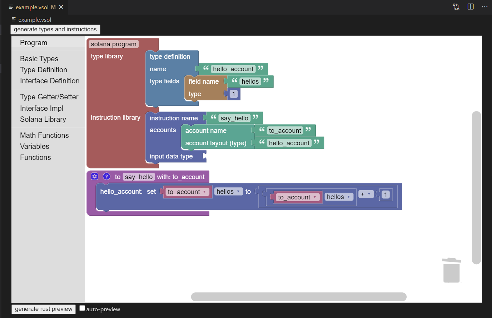

# VisualSolana (*.vsol)

VisualSolana is a VS Code extension for rapid prototyping of programs that run on Solana.

## About

The VisualSolana plugin is built on [the Blockly project](https://developers.google.com/blockly) and implements both custom blocks and custom generator to generate Rust code.

VisualSolana implements two components in the development cycle:
* An interface language to simplify prototyping complex memory structures
* A visual programming language for backend implementation

---

---

## Getting Started

Examples are located here: https://github.com/VisualSolana/examples

The VisualSolana extension is compatable with GitPod and can be used with just a web browser!

To install locally, follow the [Open VSX guide](https://github.com/eclipse/openvsx/wiki/Using-Open-VSX-in-VS-Code) to search this registry.

[Link to entry on Open VSX registry](https://open-vsx.org/extension/visualsolana/visualsolana)